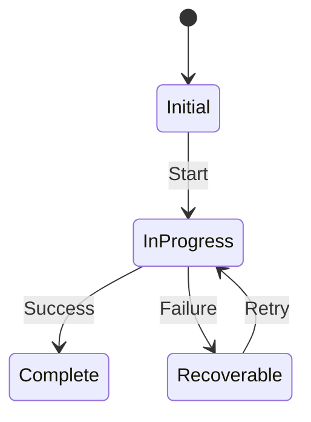
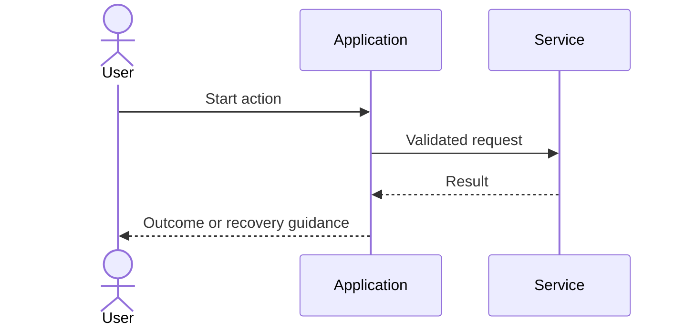

# Build Specification: [Feature Name]

> Status: Draft  
> Owner: [Name/team]  
> Last updated: [YYYY-MM-DD]  
> Change classification: [BREAKING | NON_BREAKING | TBD]  
> Human review document: [PRESS-RELEASE.md](./PRESS-RELEASE.md)

## Implementation Brief

[Summarize the customer, problem, desired outcome, proposed capability, and why it matters. This must make the file understandable without conversation history.]

### Source of truth

- Product intent and approval: [PRESS-RELEASE.md](./PRESS-RELEASE.md)
- Implementation behavior and acceptance: this document
- Repository conventions: [Paths to applicable AGENTS.md, README, or architecture documents]

## Confirmed Decisions and Boundaries

### Decisions

| ID | Decision | Rationale/source |
|---|---|---|
| D-001 | [Confirmed decision] | [User decision, repository fact, or press release section] |

### Assumptions

| ID | Assumption | Validation/status |
|---|---|---|
| A-001 | [Explicit assumption] | [Accepted or owner/date to validate] |

### Open questions

| ID | Question | Owner | Implementation impact |
|---|---|---|---|
| Q-001 | [Open question] | [Owner] | [Blocked behavior or accepted deferral] |

### Scope

#### In scope

- [Item]

#### Non-goals

- [Item]

## Customer, Roles, and Permissions

### Customer and job to be done

[Persona, trigger, job, current workaround, frequency, severity, and desired outcome]

### Roles and permissions

| Role/state | View | Create/change | Approve/administer | Ownership rule |
|---|---:|---:|---:|---|
| [Role] | [Rule] | [Rule] | [Rule] | [Rule] |

### Entitlement and billing

[Eligibility, pricing, limits, trials, account selection, and billing failure behavior]

## Experience Specification

### Entry points and eligibility

[Where the capability appears and the exact states in which it is available or hidden]

### End-to-end flow

1. [Entry]
2. [Primary action]
3. [Validation or confirmation]
4. [Outcome]

### UI surfaces and interaction states

[Screens/components plus loading, empty, validation, error, offline, disabled, retry, timeout, conflict, partial-success, cancellation, and accessibility behavior]

### Copy, content, and notifications

[Required labels, confirmation language, notifications, recipients, preferences, and communication failure behavior]

## Functional Contract

### Functional requirements

| ID | Requirement | Rationale/source |
|---|---|---|
| FR-001 | [Testable requirement] | [Decision or repository fact] |

### Business rules

| ID | Rule |
|---|---|
| BR-001 | [Unambiguous rule] |

### State and lifecycle

[Describe creation, transitions, terminal states, ownership, retention, deletion, audit, and recovery.]

## Data and System Design

### Data model and migration

[Entities, fields, types, validation, ownership, retention, deletion, indexes, local storage, migration, and backward compatibility]

### APIs, events, jobs, and integrations

[Contracts, authentication, authorization, idempotency, retries, timeouts, ordering, compatibility, and failure handling]

### System flow

### Analytics and observability

| Signal/event | Trigger | Properties (non-sensitive) | Purpose/owner |
|---|---|---|---|
| [Name] | [Trigger] | [Properties] | [Purpose/owner] |

[Also specify logs, traces, alerts, dashboards, privacy constraints, baseline, target/direction, and measurement window.]

## Quality, Rollout, and Operations

### Quality attributes

- Security and privacy: [Requirements]
- Accessibility: [Requirements]
- Localization: [Requirements]
- Performance and scale: [Requirements]
- Reliability and recovery: [Requirements]
- Platform and offline behavior: [Requirements]

### Rollout, migration, and rollback

[Phases, cohorts, feature flags, migrations, compatibility, support, monitoring, rollback triggers, and rollback procedure]

### Operational ownership

[Owners, support workflow, manual intervention, runbooks, incident handling, and known operational limits]

## Verification Contract

### Testing strategy

[Unit, integration, end-to-end, contract, migration, accessibility, localization, performance, security, and manual tests]

### Acceptance criteria

| ID | Given | When | Then |
|---|---|---|---|
| AC-001 | [Precondition] | [Action] | [Observable result] |

### Regression guardrails

- [Existing behavior that must remain intact]

## Repository Impact

### Existing components and services to reuse

- `[path]` → `[symbol]`: [How it is reused]

### Areas likely to change

- `[path]` → `[symbol or responsibility]`: [Expected change]

### Constraints and conflicts

- [Repository fact that constrains implementation]

## Implementation Sequence

1. [Dependency-aware implementation step]
2. [Next step]
3. [Verification and rollout step]

## Decision History

| Date | Decision/change | Reason | Approved by |
|---|---|---|---|
| [YYYY-MM-DD] | [Item] | [Reason] | [Owner] |
